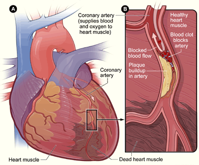

<style>
  /*Estilos para la hora de generar HTML del fichero*/
  blockquote {
      padding: 10px 20px;
      margin: 0 0 20px;
      font-size: 14px;
      border-left: 5px solid #eee;
  }
  .figure {
    margin-top: 5rem;
  }
  .figure-caption {
    font-size: 12px;
    margin-top: 0;
    margin-bottom: 10px;
    margin-left: auto;
    margin-right: auto;
    padding-top: 0;
    max-width: 640px;
  }
  .with-margin-top {
    margin-top: 5rem;
  }
  .with-margin-bottom {
    margin-bottom: 5rem;
  }
</style>

# Introducción

<p align="center" class="figure with-margin-bottom">
    
</p>

Según el *National Heart, Lung, and Blood Institute*, [la enfermedad coronaria es una de las principales causas de muerte en los Estados Unidos](https://www.nhlbi.nih.gov/health-topics/espanol/enfermedad-coronaria). Y esto ocurre aún pudiendo controlar muchos de los factores de riesgo para prevenir la enfermedad.

Además, según la Organización Mundial de la Salud, [las enfermedades cardiovasculares (entre la que se encuentra la enfermedad coronaria) son la principal causa de muerte en el mundo](https://www.who.int/es/news-room/fact-sheets/detail/cardiovascular-diseases-(cvds)).

Debido a la frecuencia de esta enfermedad, en este trabajo se intenta crear un modelo para predecir si un paciente padece esta enfermedad a partir de unas serie de variables medidas como la frecuencia cardíaca o el nivel de colesterol en sangre.


# Contexto 

## Sangre y corazón

La sangre es vital para el correcto funcionamiento del cuerpo. Entre sus funciones se encuentra el transporte de oxígeno y nutrientes a las células además de la retirada de las sustancias de desecho de las mismas.

La sangre es transportada por todo el cuerpo gracias a que es bombeada por el corazón. Este recibe sangre con poco oxígeno que manda a los pulmones para que se oxigene y la sangre que recibe de los pulmones la bombea al resto del cuerpo.

<p align="center" class="figure">
  
</p>
<p class="figure-caption">Flujo de la sangre a través de las cavidades del corazón. Las flechas azules representan la sangre sin oxigenar que se recibe del resto del cuerpo y se manda a los pulmones. Las flechas rojas representan la sangre proveniente de los pulmones que se manda al resto del cuerpo</p>
<p class="figure-caption">By josiño - Own work, Public Domain, https://commons.wikimedia.org/w/index.php?curid=9396374</p>

Un aporte inadecuado de sangre puede llevar a que las células no obtengan suficiente energía para realizar sus funciones, provocando su muerte en el peor caso.


## Enfermedad coronaria

El corazón también necesita oxígeno y nutrientes para continuar realizando su función, estos llegan por unas arterias conocidas como arterias coronarias. Cuando se da una enfermedad coronaria se habla de una dificultad del flujo sanguíneo en estas arterias debido a la acumulación de sustancias sobre sus paredes.

<p align="center" class="figure">
  
</p>
<p class="figure-caption">Muerte de células del corazón por una isquemia en las arterias coronarias.</p>
<p class="figure-caption">By NIH: National Heart, Lung and Blood Institute - http://www.nhlbi.nih.gov/health/health-topics/topics/heartattack/, Public Domain, https://commons.wikimedia.org/w/index.php?curid=25287085</p>

En el peor caso, el efecto de privar a las células del corazón de nutrientes y oxígeno da lugar a un infarto, es decir, la muerte de parte de las células del corazón. Lo cuál, a su vez, tiene repercusión en el resto del cuerpo pues el bombeo de sangre se ve afectado al debilitarse el corazón.


## Glosario de términos

- **Aterosclerosis:** acumulación de sustancias sobre las paredes de las arterias pudiendo dificultar el flujo sanguíneo. Además, la ruptura de esta placa de sustancias puede causar la formación de un coágulo de sangre (trombo) que, a su vez, puede bloquear aún más la zona afectada o dirigirse a otras partes del cuerpo y bloquear otras zonas (émbolo) (Fuentes: [American Heart Association](https://www.heart.org/en/health-topics/cholesterol/about-cholesterol/atherosclerosis), [Mayo Clinic](https://www.mayoclinic.org/es-es/diseases-conditions/arteriosclerosis-atherosclerosis/symptoms-causes/syc-20350569))

- **Isquemia:** reducción del flujo sanguíneo en un órgano (como el corazón). Esto implica una reducción del aporte de oxígeno y nutrientes, por lo que las células no pueden obtener la energía suficiente para realizar sus funciones de manera normal. (Fuentes: [American Heart Association](https://www.heart.org/en/health-topics/heart-attack/about-heart-attacks/silent-ischemia-and-ischemic-heart-disease), [Mayo Clinic](https://www.mayoclinic.org/es-es/diseases-conditions/myocardial-ischemia/symptoms-causes/syc-20375417), [Wikipedia](https://en.wikipedia.org/wiki/Ischemia))

- **Angina:** molestia en el pecho debido a una isquemia en las arterias coronarias. (Fuentes: [United Kingdom National Health Service](https://www.nhs.uk/conditions/angina/), [Video sobre angina de Alberto Sanagustín](https://www.youtube.com/watch?v=3UhItS50mRI))

- **Angina estable:** angina que se da en situaciones que demanden oxígeno (por ejemplo durante el ejercicio o en situaciones de estrés) y se calma en reposo

- **Angina inestable:** angina que además de poderse dar durante un esfuerzo también puede darse estando en reposo

- **Angina típica y atípica:** se habla de angina típica cuando se manifiesta como una molestia alrededor del pecho. Sin embargo, algunas personas pueden no notar esta molestia sino otros síntomas como náusea o dificultad respiratoria. Se habla, entonces, de una angina atípica que suele ser más común en mujeres. (Fuentes: [Harrington Hospital](https://www.harringtonhospital.org/typical-and-atypical-angina-what-to-look-for/), [Wikipedia](https://en.wikipedia.org/wiki/Angina#Diagnosis))

- **Trombo:** es un coágulo de sangre, es decir, masa de sangre en estado sólido que obstruye el paso de la sangre en un vaso sanguíneo. (Fuente: [MedlinePlus](https://medlineplus.gov/spanish/ency/article/001124.htm))

- **Émbolo:** trombo que se desprende y se dirigirse a otras partes del cuerpo. (Fuente: [MedlinePlus](https://medlineplus.gov/spanish/ency/article/001124.htm))

- **Infarto agudo de miocardio:** también conocido como ataque cardíaco, es la muerte de parte del músculo del corazón debido a una isquemia. Es decir, la muerte de parte de las células del músculo por falta de oxígeno y nutrientes. (Fuentes: [Healthline](https://www.healthline.com/health/acute-myocardial-infarction#causes), [Wikipedia](https://en.wikipedia.org/wiki/Infarction))

- **Electrocardiograma:** registro en un gráfico de las señales eléctricas que provocan los latidos del corazón. A las distintas partes del registro de un latido normal se les ha dado un nombre distintivo, los más interesantes para el proyecto son la onda T y el segmento ST porque pueden dar información acerca de la presencia de problemas como isquemia, infarto, etc. (Fuentes: [Mayo Clinic](https://www.mayoclinic.org/es-es/tests-procedures/ekg/about/pac-20384983), [Wikipedia](https://es.wikipedia.org/wiki/Electrocardiograma), [Video sobre electrocardiograma de Alberto Sanagustín](https://www.youtube.com/watch?v=A67NDj3_RrU), [Serie de videos sobre el electrocardiograma normal de Alberto Sangaustín](https://www.youtube.com/watch?v=SLe281LBBRU&list=PL3BE5DA0A5DF3BF75)).

- **Prueba de esfuerzo nuclear:** se inyecta un tinte radioactivo al paciente para poder ver el flujo de la sangre en reposo y haciendo ejercicio. Además, también se mide la actividad eléctrica del corazón (electrocardiograma). (Fuentes: [Mayo Clinic](https://www.mayoclinic.org/tests-procedures/nuclear-stress-test/about/pac-20385231), [Healthline](https://www.healthline.com/health/thallium-stress-test))

- **Enfermedad Asintomática**: una enfermedad se considera asintomática si un paciente advierte muy pocos síntomas o ninguno. (Fuentes: [definicion.de](https://definicion.de/asintomatico/), [MayoClinic](https://www.mayoclinic.org/es-es/diseases-conditions/heart-attack/expert-answers/silent-heart-attack/faq-20057777))

- **Hipertrofia del ventrículo izquierdo:** engrosamiento de las paredes de la cavidad del corazón que impulsa la sangre al resto del cuerpo. Esto puede hacer que el músculo pierda elasticidad y el corazón deje de funcionar adecuadamente. (Fuente: [Mayo Clinic](https://www.mayoclinic.org/es-es/diseases-conditions/left-ventricular-hypertrophy/symptoms-causes/syc-20374314))


# Conjunto de datos

El conjunto de datos ha sido tomado de Kaggle ([Heart Disease UCI](https://www.kaggle.com/ronitf/heart-disease-uci)), que a su vez ha sido tomado de [UCI Machine Learning Repository](https://archive.ics.uci.edu/ml/datasets/Heart+Disease). Se tienen datos de alrededor de 300 pacientes de Cleveland y las variables que se recogen están descritas en una sección siguiente.


## Problemas con el conjunto de datos

Gracias al [*post* del usuario *InitPic*](https://www.kaggle.com/ronitf/heart-disease-uci/discussion/105877) se ha podido advertir que el conjunto de datos en Kaggle es distinto al de *UCI Machine Learning Repository* pero la descripción de los datos es la misma. Así que la descripción de los datos en la siguiente sección se ha hecho ajustándose a los datos que tenemos.

Parte de este cambio con respecto a los datos originales es que los valores nulos en el conjunto original aquí toman un valor numérico:

> A few more things to consider:
> 
> data #93, 159, 164, 165 and 252 have ca=4 which is incorrect. In the original Cleveland dataset they are NaNs (so they should be removed)
> 
> data #49 and 282 have thal = 0, also incorrect. They are also NaNs in the original dataset.

Como son pocos registros, en este trabajo se ha optado por descartarlos del conjunto.


## Variables de los datos

```{r message=FALSE, warning=FALSE}
# Libraries
library(ggplot2)
library(caret)
library(rpart.plot)
```

```{r}
# Leemos los datos
data <- read.csv('../data/heart.csv')

# El conjunto de datos tiene unos registros con valores no disponibles,
# como son muy pocos lo más sencillo es quitarlos del conjunto.
# En el conjunto de datos de Kaggle los missing value
# tienen unos valores numéricos: 4 para ca, 0 para thal
missing_ca_indeces <- which(data$ca %in% 4)
missing_thal_indeces <-which(data$thal %in% 0)
missing_values_indeces <- c(missing_ca_indeces, missing_thal_indeces)
data <- data[-missing_values_indeces, ]

# Transformamos el tipo de las variables categóricas a factores
data$sex <- as.factor(data$sex)
data$cp <- as.factor(data$cp)
data$fbs <- as.factor(data$fbs)
data$restecg <- as.factor(data$restecg)
data$exang <- as.factor(data$exang)
data$slope <- as.factor(data$slope)
data$thal <- as.factor(data$thal)
data$target <- as.factor(data$target)

# Le damos un nombre más amigable a los valores de los factores para las gráficas
levels(data$sex) <- c("Mujer", "Hombre")
levels(data$cp) <- c("Asintomático", "Angina atípica", "Sin angina", "Angina típica")
levels(data$fbs) <- c("No", "Sí")
levels(data$restecg) <- c("Hipertrofia", "Normal", "Anormalidades")
levels(data$exang) <- c("No", "Sí")
levels(data$slope) <- c("Descendente", "Plano", "Ascendente")
levels(data$thal) <- c("Defecto fijo", "Flujo normal", "Defecto reversible")
levels(data$target) <- c("Padece", "No_padece")
```

### target

Variable objetivo: indica si el paciente padece una enfermedad coronaria o no.

- Valor 0: padece enfermedad
- Valor 1: no padece enfermedad

Podemos observar que la distribución está bastante equilibrada. Gracias a esto no sería mala idea usar la precisión de los modelos como una medida general de su calidad.

```{r,fig.align='center',fig.height=4}
ggplot(data, aes(data$target, fill=data$target)) + 
  geom_bar() +
  labs(x="Enfermedad", y="Número de pacientes") +
  guides(fill=FALSE)
```

### age

Edad del paciente en años. En los datos se refleja, como cabe esperar, que la edad es un factor de riesgo, es decir, a mayor edad más probabilidad de padecer esta enfermedad.

```{r,fig.align='center',fig.height=4}
ggplot(data, aes(data$age, fill=data$target)) + 
  geom_histogram(binwidth=1) +
  labs(fill="Enfermedad", x="Edad", y="Número de pacientes")
```

### sex

Sexo del paciente

- Valor 0: mujer
- Valor 1: hombre

Hay aproximadamente la mitad de datos de mujeres que de hombres. Sin embargo, se puede ver que la edad es también un factor de riesgo para los hombres como se indica en varias de las referencias.

```{r,fig.align='center',fig.height=4}
ggplot(data, aes(data$sex, fill=data$target)) + 
  geom_bar() +
  labs(fill="Enfermedad", x="Sexo", y="Edad")
```

### cp

Tipo de dolor en el pecho

- Valor 0: asintomático (no presenta síntomas o muy pocos)
- Valor 1: angina atípica (posible dolor de angina)
- Valor 2: dolor sin relación con angina
- Valor 3: angina típica

La descripción de los datos originales no aporta mucha más información acerca de cómo se llegó a esta clasificación para el tipo de dolor. Sin embargo, se puede ver que un médico atendiendo sólo al tipo de dolor del paciente tiende a fallar bastante a la hora de determinar que un paciente tiene angina pues en la mayoría de los casos resulta que no padece enfermedad coronaria.

```{r,fig.align='center',fig.height=4}
ggplot(data, aes(data$cp, fill=data$target)) +
  geom_bar() +
  labs(fill="Enfermedad", x="Tipo de dolor en el pecho", y="Número de pacientes")
```


### trestbps

Presión sanguínea en reposo en milímetros de mercurio (mm Hg) en el momento de ser ingresado en el hospital.

Por los distintos picos que se ven en el histograma parece que los pacientes tienden a tener una presión normal dentro de su grupo (adultos sanos, adultos que toman medicamentos, tercera edad, etc). Y también parece que un nivel elevado puede ser un buen indicativo de que el paciente presente la enfermedad.

```{r,fig.align='center',fig.height=4}
ggplot(data, aes(data$trestbps, fill=data$target)) +
  geom_histogram(binwidth=3) +
  labs(fill="Enfermedad", x="Presión sanguínea (mm Hg)", y="Número de pacientes")
```

### chol

Colesterol en mg/dl. Una variable que las personas podemos controlar, se puede ver que a mayor colesterol mayor índice de aparición de la enfermedad. Resulta curioso que los casos más extremos de colesterol no padezcan la enfermedad, esto puede deberse a otras variables que no podemos ver en este sencillo histograma. O puede ser por variables no observadas, por ejemplo, puede ser que estos pacientes realmente no estuvieran en ayunas a la hora de tomar las muestras de sangre.

```{r,fig.align='center',fig.height=4}
ggplot(data, aes(data$chol, fill=data$target)) +
  geom_histogram(binwidth=10) +
  labs(fill="Enfermedad", x="Colesterol (mg/dl)", y="Número de pacientes")
```


### fbs

Si el nivel de azúcar en sangre en ayunas es mayor a 120 mg/dl o no. Esta es otra variable que se puede controlar. Sin embargo, por sí sola no parece ser muy útil para determinar si un paciente presenta una enfermedad o no. Aunque a priori no podemos descartarla puede que junto con otras variables sí ayude a determinar mejor si un paciente padece o no una enfermedad.

- Valor 0: no
- Valor 1: sí

```{r,fig.align='center',fig.height=4}
ggplot(data, aes(data$fbs, fill=data$target)) +
  geom_bar() +
  labs(fill="Enfermedad", x="Nivel de azúcar > 120 mg/dl", y="Número de pacientes")
```

A partir de aquí las variables están relacionadas con una prueba de esfuerzo nuclear. Es decir, una prueba de esfuerzo donde además se inyecta un tinte radiactivo al paciente para ver gráficamente su flujo sanguíneo.

### restecg

Resultado del electrocardiograma en reposo.

- Valor 0: posible hipertrofia en el ventrículo izquierdo
- Valor 1: normal
- Valor 2: se ven anormalidades en la onda T o segmento ST

Cuando se presenta una enfermedad coronaria, el primer síntoma suele ser angina al hacer un esfuerzo. Cuando la angina aparece hasta estando en reposo significa que se ha agravado la enfermedad (normalmente debido a un mayor estrechamiento de las arterias). Por esto son pocos los pacientes a los que se les ve una anormalidad en la actividad del corazón estando en reposo, lo cuál es muy indicativo de la presencia de una enfermedad coronaria. Y también esto explica que una buena parte de los pacientes tengan la enfermedad aún teniendo un ritmo cardíaco normal en reposo.

Por otro lado la *posible* presencia de una hipertrofia en el ventrículo izquierdo no parece ser muy indicativo por sí solo de la presencia de una enfermedad. Lo más probable es que este valor no se pudiera medir con la suficiente precisión.

```{r,fig.align='center',fig.height=4}
ggplot(data, aes(data$restecg, fill=data$target)) +
  geom_bar() +
  labs(fill="Enfermedad", x="Electrocardiograma en reposo", y="Número de pacientes")
```

### thalach

Frecuencia cardíaca máxima alcanzada durante la prueba de esfuerzo.

A simple vista puede parecer raro que los pacientes con una mayor frecuencia cardíaca tengan una menor frecuencia de presencia de enfermedad y viceversa. Sin embargo, tiene más sentido al tener en cuenta que la frecuencia cardíaca máxima de una persona depende de la edad (220 - edad). Las mayores frecuencias máximas suelen corresponder a gente más joven.


```{r,fig.align='center',fig.height=4}
ggplot(data, aes(data$thalach, fill=data$target)) +
  geom_histogram(binwidth=10) +
  labs(fill="Enfermedad", x="Frecuencia cardíaca máxima durante el ejercicio", y="Número de pacientes")
```

<p class="with-margin-top"></p>
**Pacientes con una frecuencia cardíaca máxima durante el ejercicio menor a 100:**
```{r}
data[data$thalach < 100, c("age", "thalach", "target")]
```

<p class="with-margin-top"></p>
**Pacientes con una frecuencia cardíaca máxima durante el ejercicio mayor a 180:**
```{r}
data[data$thalach > 180, c("age", "thalach", "target")]
```


### exang

Si haciendo ejercicio el paciente tuvo angina o no

- Valor 0: no
- Valor 1: sí

Se puede ver que la presencia de angina durante ejercicio es un buen indicador de que el paciente padezca una enfermedad coronaria. Sin embargo, también se vuelve a ver que determinar lo que es angina no es algo sencillo pues se puede confundir con otros dolores o puede ser una angina atípica.

```{r,fig.align='center',fig.height=4}
ggplot(data, aes(data$exang, fill=data$target)) +
  geom_bar() +
  labs(fill="Enfermedad", x="Presencia de angina durante el ejercicio", y="Número de pacientes")
```

### oldpeak

Descenso del segmento ST al hacer ejercicio en relación con el mismo en reposo.

El segmento ST es una parte del electrocardiograma de un latido que suele encontrarse a un cierto nivel en un latido normal. Un desplazamiento significativo de este segmento puede ser un indicativo de la presencia de una enfermedad coronaria como se puede ver en los datos.

```{r,fig.align='center',fig.height=4}
ggplot(data, aes(data$oldpeak, fill=data$target)) +
  geom_histogram(binwidth=0.25) +
  labs(fill="Enfermedad", x="Depresión del segmento ST", y="Número de pacientes")
```


### slope

Pendiente del segmento ST durante la parte más exigente del ejercicio

- Valor 0: descendente
- Valor 1: plano
- Valor 2: ascendente

En la primera gráfica se puede ver que la pendiente por si sola puede ayudar a determinar la presencia de una enfermedad si resulta plana o ascendente. Sin embargo, que la pendiente sea descendente por sí solo no parece dar mucha información. Por ello, en la segunda gráfica se añade una tercera variable y se puede ver que, si la pendiente es descendente, la depresión del segmento ST puede ayudar bastante a determinar si un paciente padece una enfermedad coronaria.

```{r,fig.align='center',fig.height=4}
ggplot(data, aes(data$slope, fill=data$target)) +
  geom_bar() +
  labs(fill="Enfermedad", x="Pendiente del segmento ST", y="Número de pacientes")
```

```{r,fig.align='center',fig.height=4}
ggplot(data, aes(x=data$slope, y=data$oldpeak, fill=data$target)) +
  geom_boxplot() +
  labs(fill="Enfermedad", x="Pendiente del segmento ST", y="Depresión del segmento ST")
```


### thal

Resultados del flujo sanguíneo medido con el tinte radioactivo

- Valor 0: NULL (descartados del conjunto de datos en una celda de código previa)
- Valor 1: defecto fijo (no se observa flujo sanguíneo en alguna parte del corazón)
- Valor 2: flujo sanguíneo normal
- Valor 3: defecto reversible (se observa flujo sanguíneo pero no es normal)

Esta variable, al igual que la siguiente, se obtiene de un proceso bastante intrusivo para los pacientes. Pero por si solas dan una indicación bastante acertada de la presencia o no de una enfermedad coronaria.

```{r,fig.align='center',fig.height=4}
ggplot(data, aes(data$thal, fill=data$target)) +
  geom_bar() +
  labs(fill="Enfermedad", x="Resultados flujo sanguíneo", y="Número de pacientes")
```


### ca

Número de vasos sanguíneos principales coloreados por el tinte radioactivo. El número varía de 0 a 4 aunque el valor 4 representa un valor nulo, los cuales se han quitado del conjunto de datos en una celda anterior.

Esta variable se refiere al número de vasos sanguíneos estrechos que se han visto, por ello se puede ver en los datos que a un mayor valor de esta variable mayor es la frecuencia de presencia de una enfermedad coronaria.

```{r,fig.align='center',fig.height=4}
ggplot(data, aes(data$ca, fill=data$target)) +
  geom_bar() +
  labs(fill="Enfermedad", x="Resultados flujo sanguíneo", y="Número de pacientes")
```


# Modelos

Para esta parte he elegido cuatro modelos. Tres modelos son sencillos: regresión logística por ser uno de los modelos con más historia, naive bayes para ver hasta dónde se puede llegar con la asunción de que las variables sean independientes y árboles de decisión para compararlo con el cuarto modelo. El último modelo es random forest para comparar las métricas de los otros modelos con uno que no es tan fácil de interpretar.

Los valores no disponibles ya han sido eliminado de los datos en una celda de código anterior. También se han convertido las variables categóricas al tipo factor de R. Aparte de eso no ha hecho falta realizar ningún preprocesado de los datos pues parece que ya se realiza un preprocesado antes de entrenar los modelos. Por ejemplo, en regresión logística no ha hecho falta convertir los datos categóricos a numéricos, ni lidiar con la multicolinearidad.

Para poder evaluar los clasificadores primero vamos a dividir el conjunto de datos en entrenamiento (70%) y testeo (30%). Esto intentando que la distribución de la variable objetivo sea la misma en ambos. 

```{r}
# Divide el conjunto de datos en entrenamiento y testeo
# manteniendo la misma distribución de la variable objetivo
set.seed(8)
training_indeces <- createDataPartition(data$target, p = .7, list = FALSE)
data.train <- data[ training_indeces,]
data.test  <- data[-training_indeces,]

# Validación cruzada de 10 pliegues
fitControl <- trainControl(method="cv", number=10)
```

El conjunto de testeo imita a datos nuevos en el mundo real, sólo se usará al final del proyecto para obtener una medida fiable del clasificador elegido sobre datos que no ha visto nunca.

El conjunto de entrenamiento se usará para evaluar los modelos mediante validación cruzada de 10 pliegues. Por simplicidad dejaremos la elección de los hiperparámetros por defecto, esto significa que se elegirán unos valores aleatorios y se entrenarán los clasificadores mediante validación cruzada por cada combinación.

## Regresión logística

```{r}
set.seed(8)
model.lr <- train(target ~ ., 
              data = data.train,
              method = "glm",
              family=binomial(),
              trControl = fitControl)
model.lr
```

Parece que esta implementación de regresión logística no tiene hiperparámetros que se puedan especificar. Sin embargo, ya vemos unos resultados de validación cruzada bastante interesantes. La precisión es bastante buena y un índice Kappa de casi 0.7 lo cuál suele considerarse bastante bueno también.


## Árbol de decisión

```{r}
set.seed(8)
model.tree <- train(target ~ ., 
              data = data.train,
              method = "rpart",
              trControl = fitControl)
model.tree
```

Para el árbol de decisión se ha probado con 3 hiperparámetros. `cp` es un hiperparámetro de `rpart` que gobierna la complejidad del modelo: menores valores dan árboles más complejos. Podemos ver que con los menores valores del hiperparámetro salen mejores árboles, seguramente porque con los `cp` mayores los árboles resultan muy pequeños.

```{r,fig.align='center',fig.height=4}
plot(model.tree)
```

Las métricas son aceptables y además, el árbol resultante es bastante pequeño y fácil de interpretar como se ve a continuación.

Vemos que la frecuencia cardíaca en el ejercicio es la variable principal, sólo con esto (e implícitamente la edad) se puede decidir que una persona no padezca una enfermedad coronaria, acertando en el 76% de los casos. Si además se incluye el número de vasos sanguíneos coloreados por el tinte, se puede ver que es muy probable que una persona con una frecuencia cardíaca alta durante el ejercicio y sin vasos sanguíneos coloreados no padezca una enfermedad coronaria.

Una mejor estrategia de elección de hiperparámetros sería una vía sencilla para intentar obtener resultados mejores, siempre teniendo en cuenta el riesgo del sobreajuste, claro.

```{r,fig.align='center',fig.height=4}
rpart.plot(model.tree$finalModel)
```

## Naive bayes

```{r}
set.seed(8)
model.nb <- train(target ~ ., 
              data = data.train,
              method = "naive_bayes",
              trControl = fitControl)
model.nb
```

```{r,fig.align='center',fig.height=4}
plot(model.nb)
```

Parece que se pueden obtener resultados bastante aceptables asumiendo que las variables son totalmente independientes entre sí. Tampoco es de sorprender pues este modelo es conocido por dar también resultados aceptables en la clasificación de mensajes de SPAM.


## Random Forest

```{r}
set.seed(8)
model.rf <- train(target ~ ., 
              data = data.train,
              method = "rf",
              trControl = fitControl)
model.rf
```

```{r,fig.align='center',fig.height=4}
plot(model.rf)
```

Curiosamente este modelo sigue siendo considerablemente peor que regresión logística. Puede que con una mejor estrategia para elegir los valores de los hiperparámetros esto hubiése sido distinto.

# Resultados

## Resumen del entrenamiento

En las tablas siguientes se puede ver un resumen de los resultados de los 10 pliegues de validación cruzada.

```{r}
model.all <- list(RegLogistica=model.lr, Arbol=model.tree, NaiveBayes=model.nb, RandomForest=model.rf)
results <- resamples(model.all)
summary(results, metric=c("Kappa", "Accuracy"))
```

Regresión logística ha sido el mejor claramente teniendo en cuenta las métricas. Además, sus  métricas no varían mucho si vemos los cuartiles. 

Por otro lado, el resto de modelos tienen métricas que varían más, lo que indica que pueden no ser tan fiables para tratar con datos nuevos. El árbol de decisión me sorprendió gratamente debido a su sencillez, pero parece ser el menos fiable, tal vez con una mejor elección de hiperparámetros resulte un modelo más robusto.

Como resultados finales vamos a ver los de regresión logítica por ser el mejor modelo. Y también vamos a ver los del árbol para ver si en el conjunto de testeo varían mucho las métricas con respecto a la media de validación cruzada.

## Resultados finales

Primero se muestran los resultados de regresión logística

```{r}
preds <- predict(model.lr, data.test)
confusionMatrix(preds, data.test$target)
```

Podemos ver que se mantienen más o menos las mismas métricas que con validación cruzada, lo cuál es bastante positivo. Y se tiene una matriz de confusión con la mayoría de las observaciones en la diagonal principal.

Por otra parte, los resultados en el árbol de decisión son mucho peores, como era de esperar son resultados bastante distintos a la media de validación cruzada.

```{r}
preds.tree <- predict(model.tree, data.test)
confusionMatrix(preds.tree, data.test$target)
```


# Conclusiones

Se ha conseguido adquir unos conocimientos básicos acerca de un tema bastante alejado de la informática. Esta es una habilidad bastante importante en la ciencia de datos pues el conocimiento sobre el dominio específico que se está tratando nos permite entender lo que estamos haciendo y tomar mejores decisiones.

En este proyecto, este conocimiento ha servido para entender las variables pues la descripción original era bastante limitada. Sin embargo, también se podría usar este conocimiento para crear nuevas variables que puedan mejorar el rendimiento de los clasificadores, por ejemplo, se podría discretizar la edad, intentar elimitar el factor de la edad en la frecuencia cardíaca, combinar la edad con la presión sanguínea, combinar el nivel de descenso del segmento ST con su pendiente, etc.

Otra posible vía para mejorar los resultados sería mejorar la elección de los hiperparámetros de los modelos o elegir otros modelos.

Hemos visto cómo el uso de validación cruzada no se debe centrar en ver sólo un estadístico como la media. Esto ha servido para determinar el mejor modelo y comprobar que un modelo que tiene resultados bastantes dispersos durante el entrenamiento no generaliza bien con datos nuevos.

Finalmente, se ha obtenido un clasificador de la presencia de una enfermedad coronaria con unos resultados bastante aceptables.

# Autor y repositorio

El autor de este proyecto es Carlos Domínguez García y el código del proyecto, así como el resto de recursos usados se pueden encontrar en el [repositorio de Github del proyecto](https://github.com/carlosdg/PrediccionEnfermedadCoronaria).